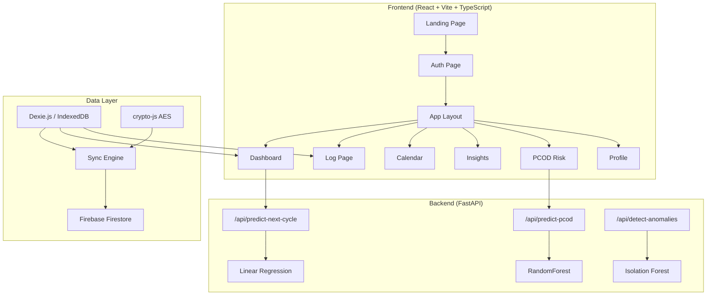

# FemTrack AI — Build Walkthrough

## Summary

Built a complete full-stack Progressive Web App for smart period tracking and PCOD risk prediction. The project includes **50+ files** across a React/TypeScript frontend and a Python FastAPI backend with ML models.

## Architecture



## Files Created (50+)

### Frontend Core
| File | Purpose |
|------|---------|
| [package.json](file:///d:/antigravity%20projects/FemTrack%20AI/frontend/package.json) | All 30+ dependencies |
| [vite.config.ts](file:///d:/antigravity%20projects/FemTrack%20AI/frontend/vite.config.ts) | PWA plugin, path aliases, API proxy |
| [tailwind.config.ts](file:///d:/antigravity%20projects/FemTrack%20AI/frontend/tailwind.config.ts) | Full design system |
| [index.css](file:///d:/antigravity%20projects/FemTrack%20AI/frontend/src/styles/index.css) | Glassmorphism, blobs, gradients |
| [App.tsx](file:///d:/antigravity%20projects/FemTrack%20AI/frontend/src/App.tsx) | Router + providers + lazy loading |
| [main.tsx](file:///d:/antigravity%20projects/FemTrack%20AI/frontend/src/main.tsx) | Entry point |

### Pages (8)
| Page | Key Features |
|------|-------------|
| [Landing.tsx](file:///d:/antigravity%20projects/FemTrack%20AI/frontend/src/pages/Landing.tsx) | Hero, feature grid, stats, CTA |
| [Auth.tsx](file:///d:/antigravity%20projects/FemTrack%20AI/frontend/src/pages/Auth.tsx) | Email + Google OAuth, animated toggle |
| [Dashboard.tsx](file:///d:/antigravity%20projects/FemTrack%20AI/frontend/src/pages/Dashboard.tsx) | Cycle status, wellness ring, PCOD meter |
| [Log.tsx](file:///d:/antigravity%20projects/FemTrack%20AI/frontend/src/pages/Log.tsx) | 6-step swipeable form + confetti |
| [Calendar.tsx](file:///d:/antigravity%20projects/FemTrack%20AI/frontend/src/pages/Calendar.tsx) | Color-coded grid, bottom sheet drawer |
| [Insights.tsx](file:///d:/antigravity%20projects/FemTrack%20AI/frontend/src/pages/Insights.tsx) | 5 Recharts (area, bar, radar) |
| [PCOD.tsx](file:///d:/antigravity%20projects/FemTrack%20AI/frontend/src/pages/PCOD.tsx) | Animated gauge, factor breakdown, trend |
| [Profile.tsx](file:///d:/antigravity%20projects/FemTrack%20AI/frontend/src/pages/Profile.tsx) | Settings, theme toggle, sign out |

### Components (17)
- **Dashboard**: ParticleBackground, CycleStatusCard, WellnessRing, PCODMeter, UpcomingEvents, InsightOfDay
- **Log**: CycleStatusStep, FlowIntensityStep, SymptomsStep, MoodStep, LifestyleStep, NotesStep, Confetti
- **Layout**: Sidebar, BottomNav, AppLayout
- **Shared**: GlassCard, FloatingActionButton, SkeletonLoader, ThemeToggle

### Infrastructure
- **Auth**: AuthContext (Firebase email + Google OAuth)
- **Theme**: ThemeContext (dark/light with localStorage)
- **Data**: Dexie.js database (4 tables), sync engine, AES encryption
- **Hooks**: useCycle (computed phases, predictions, log saving), useOnlineStatus

### Backend (FastAPI)
| File | Purpose |
|------|---------|
| [main.py](file:///d:/antigravity%20projects/FemTrack%20AI/backend/main.py) | 3 API endpoints + CORS |
| [pcod_model.py](file:///d:/antigravity%20projects/FemTrack%20AI/backend/models/pcod_model.py) | RandomForest PCOD predictor |
| [cycle_predictor.py](file:///d:/antigravity%20projects/FemTrack%20AI/backend/models/cycle_predictor.py) | Linear regression + rolling mean |
| [anomaly_detector.py](file:///d:/antigravity%20projects/FemTrack%20AI/backend/models/anomaly_detector.py) | Isolation Forest |
| [generate_synthetic.py](file:///d:/antigravity%20projects/FemTrack%20AI/backend/data/generate_synthetic.py) | 2000-sample synthetic dataset |
| [train_model.py](file:///d:/antigravity%20projects/FemTrack%20AI/backend/train_model.py) | Train + evaluate + save |

## Design System

- **Colors**: Plum (#1A0A2E) dark bg, Rose (#C94B8A) primary, Lavender (#B39DDB) secondary, Cream (#F8F0FF) light, Coral (#FF6B9D) highlights
- **Typography**: Playfair Display (headings), Inter (body)
- **Cards**: Soft glassmorphism with `backdrop-filter: blur(16px)`, glow shadows
- **Animations**: Float, pulse-glow, blob, shimmer, slide transitions via Framer Motion
- **Border radius**: 16px+ everywhere

## To Run

### Frontend
```bash
cd frontend
npm install
npm run dev
```

### Backend
```bash
cd backend
pip install -r requirements.txt
python train_model.py    # Train ML models (once)
python main.py           # Start API server
```

> [!NOTE]
> The terminal sandbox was unavailable during build, so `npm install` needs to be run manually. All source code is complete and ready to compile.
